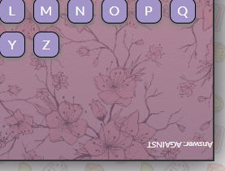
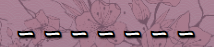
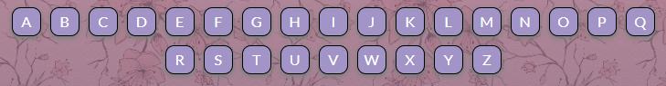
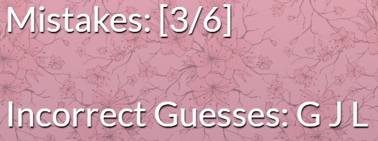
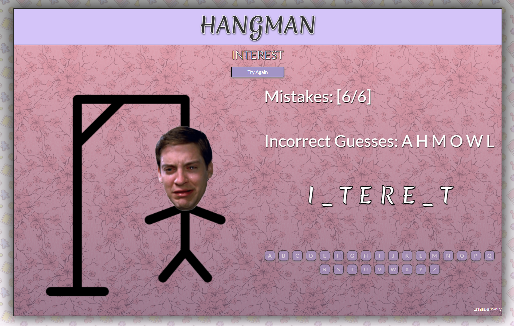

# 🧍‍ Classic Hangman Game in React.JS 🧍‍
Link to live site: https://juanscanlan.github.io/Hangman-React/

<b>Languages and Tools used:<b> 
  
   
  
  
  
  
 

Answer is upside down in the bottom right corner of keyboard:  

## How to play:
- A random word is generated on each page reload. It is hidden by dashes on the screen: 

- Click on any letter to make a guess: 

- Mistakes are recorded: 
 

 - Make 6 mistakes and you lose: 
  
 
 
 - Guess all letters correctly and be rewarded: 
  
